# Laporan Proyek Machine Learning - Reza Faisal

## Domain Keuangan
Domain yang saya angkat yaitu dibidang **Keuangan**
## Latar Belakang
Deposito berjangka merupakan sumber pendapatan utama bagi bank. Deposito berjangka adalah investasi tunai yang disimpan di lembaga keuangan. Uang Anda diinvestasikan pada tingkat bunga yang disepakati dalam jangka waktu atau jangka waktu tertentu. Bank memiliki berbagai rencana penjangkauan untuk menjual deposito berjangka kepada nasabahnya seperti pemasaran email, iklan, pemasaran telepon, dan pemasaran digital.

Kampanye pemasaran melalui telepon masih tetap menjadi salah satu cara paling efektif untuk menjangkau masyarakat. Namun, kampanye ini memerlukan investasi besar karena pusat panggilan (call center) besar dipekerjakan untuk benar-benar melaksanakan kampanye ini. Oleh karena itu, penting untuk mengidentifikasi nasabah yang paling mungkin melakukan konversi terlebih dahulu sehingga mereka dapat ditargetkan secara spesifik melalui panggilan telepon.

## Business Understanding
Berdasarkan latar belakang yang sudah dipaparkan sebelumnya, berikut rincian masalah yang dapat diselesaikan dalam proyek ini :
- Bagaimana cara mengetahui nasabah yang berpeluang untuk menerima penawaran penjualan deposito?
- Apa faktor paling berpengaruh yang menentukan nasabah menerima tawaran tersebut atau tidak?

### Goals
- Untuk mengetahui nasabah yang berpeluang untuk menerima penawaran penjualan deposito.
- Untuk mengetahui faktor paling berpengaruh yang menentukan nasabah menerima tawaran tersebut atau tidak.

    ### Solution statements
    - Melakukan proses *Exploratory Data Analysis* untuk melihat fitur yang berpengaruh terhadap nasabah untuk menerima tawaran atau tidak.
    - Menggunakan model *Machine Learning* untuk memprediksi nasabah menerima tawaran tersebut atau tidak. Berikut model yang akan digunakan:
    - *Support Vector Machine Classifier*
    - *Neural Network Classifier*

## Data Understanding
Dataset ini berasal dari platform open source *https://kaggle.com*, dataset tersebut terkait dengan kampanye pemasaran langsung (panggilan telepon) dari lembaga perbankan Portugis. Data ini terdiri dari 2 file train.csv dan test.csv yang dimana:
- train.csv memiliki 45.211 baris dan 18 kolom
- test.csv memiliki 4521 baris dan 18 kolom 

Tujuan dari proyek klasifikasi ini adalah untuk memprediksi apakah nasabah akan berlangganan deposito berjangka. 

### Informasi data:
Link dataset : https://www.kaggle.com/datasets/prakharrathi25/banking-dataset-marketing-targets
| **Attribute** | **Keterangan** | **Tipe Data** |
|---|---|---|
| age | usia nasabah | integer |
| job | pekerjaan nasabah | polynominal |
| marital | status pernikahan | polynominal |
| education | pendidikan terakhir nasabah | polynominal |
| default | nasabah memiliki kartu kredit secara default | binominal |
| balance | saldo tahunan rata-rata, dalam euro | float |
| housing | pinjaman perumahan | binominal |
| loan | pinjaman pribadi | binominal |
| contact | jenis komunikasi | polynominal |
| day | hari kontak terakhir pada bulan tersebut | integer |
| month | last contact month of year | polynominal |
| duration | durasi kontak terakhir, dalam hitungan detik | integer |
| campaign | jumlah kontak yang dilakukan selama kampanye ini dan untuk klien ini | integer |
| pdays | jumlah hari yang berlalu setelah klien terakhir dihubungi dari kampanye sebelumnya (angka, -1 berarti klien belum pernah dihubungi sebelumnya) | integer |
| previous | jumlah kontak yang dilakukan sebelum kampanye ini dan untuk klien ini | integer |
| poutcome | hasil kampanye pemasaran sebelumnya | polynominal |
| y | apakah klien sudah berlangganan deposito berjangka? | binominal |

Pada berkas berisikan data latih dan data uji dengan total 45211 baris dengan 18 kolom.
Tidak terdapat missing value, tapi memiliki data duplikat sebanyak 4521

### Berikut rangkuman `statistik deskriptif` dari fitur dalam dataset:
| **Pregnancies** | **age** | **balance** | **day** | **duration** | **campaign** | **pdays** | **previous** |
|---|---|---|---|---|---|---|---|
| count | 45.211.000.000 | 45.211.000.000 | 45.211.000.000 | 45.211.000.000 | 45.211.000.000 | 45.211.000.000 | 45.211.000.000 |
| mean | 40.936.210 | 1.362.272.058 | 15.806.419 | 258.163.080 | 2.763.841 | 40.197.828 | 580.323 |
| std | 10.618.762 | 3.044.765.829 | 8.322.476 | 257.527.812 | 3.098.021 | 100.128.746 | 2.303.441 |
| min | 18.000.000 | -8.019.000.000 | 1.000.000 | 0 | 1.000.000 | -1.000.000 | 0 |
| 25% | 33.000.000 | 72.000.000 | 8.000.000 | 103.000.000 | 1.000.000 | -1.000.000 | 0 |
| 50% | 39.000.000 | 448.000.000 | 16.000.000 | 180.000.000 | 2.000.000 | -1.000.000 | 0 |
| 75% | 48.000.000 | 1.428.000.000 | 21.000.000 | 319.000.000 | 3.000.000 | -1.000.000 | 0 |
| max | 95.000.000 | 102.127.000.000 | 31.000.000 | 4.918.000.000 | 63.000.000 | 871.000.000 | 275.000.000 |

### Berikut Visualisasi data dengan Boxplot:  
<label>Balance Boxplot</label>

<label>Duration Boxplot</label>
  

Outlier dari boxplot Balance dan Duration akan di hapus

### Berikut Visualisasi data Categorical Features pada histogram :
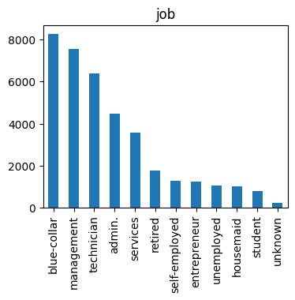  
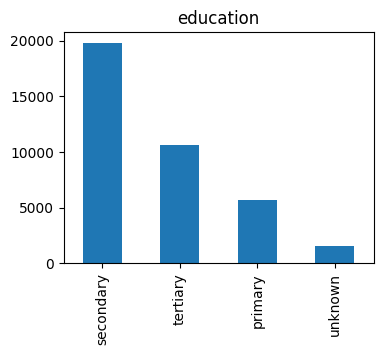 
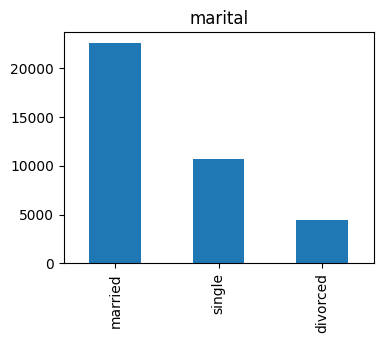 
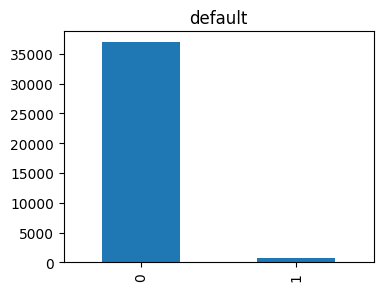 
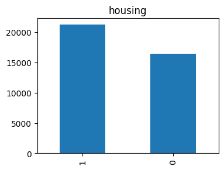 
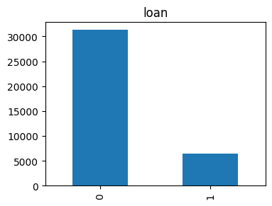 
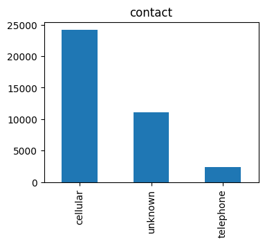 
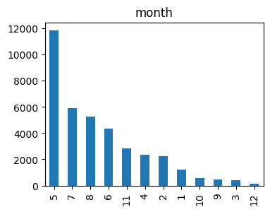 
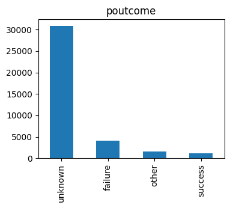 
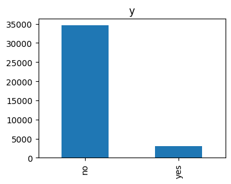 

### Berikut Visualisasi data Numerical Features pada histogram :
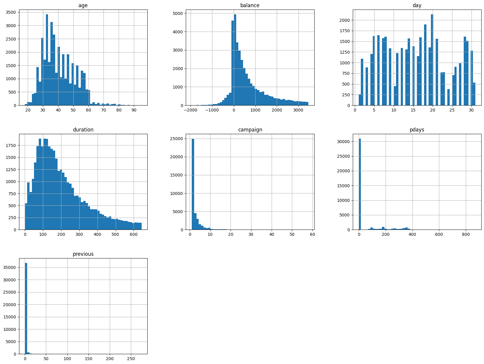 

### Multivariate Analysis
#### Categorical Data
Melihat hasil prediksi setiap Categorical Features. 
 
 
 
 
 
 
 
 
 

#### Numerical Data
Melihat Hubungan Antara Numerical Features Dengan Target yaitu "y". 
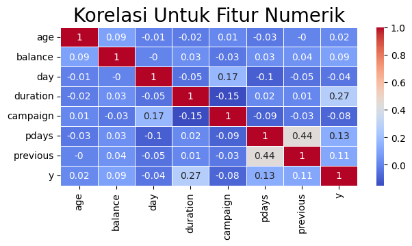 

Berdasarkan data dari tabel korelasi diatas, dapat diidentifikasi bahwa fitur age dan day memiliki nilai korelasi yang rendah sehingga fitur tersebut dapat dihapus.

## Data Preparation
- Menghapus kolom age dan day
 

- Ubah data binominal (yes/no) menjadi (1/0) agar dapat diproses oleh algoritma
 

- Ubah nama bulan menjadi angka sesuai urutan
 
 
#### Hasil Seteleh Diproses
| **job** | **marital** | **education** | **default** | **balance** | **housing** | **loan** | **contact** | **month** | **duration** | **campaign** | **pdays** | **previous** | **poutcome** | **y** |
|---|---|---|---|---|---|---|---|---|---|---|---|---|---|---|
| management | married | tertiary | 0 | 2143 | 1 | 0 | unknown | 5 | 261 | 1 | -1 | 0 | unknown | 0 |
| technician | single | secondary | 0 | 29 | 1 | 0 | unknown | 5 | 151 | 1 | -1 | 0 | unknown | 0 |
| entrepreneur | married | secondary | 0 | 2 | 1 | 1 | unknown | 5 | 76 | 1 | -1 | 0 | unknown | 0 |
| blue-collar | married | unknown | 0 | 1506 | 1 | 0 | unknown | 5 | 92 | 1 | -1 | 0 | unknown | 0 |
| unknown | single | unknown | 0 | 1 | 0 | 0 | unknown | 5 | 198 | 1 | -1 | 0 | unknown | 0 |

- OneHotEncoding data kategorik
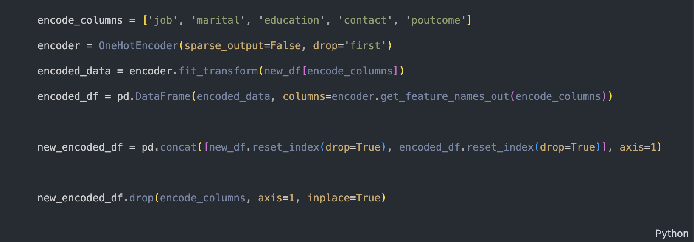 

#### Hasil OneHotEncoding
| **default** | **balance** | **housing** | **loan** | **month** | **duration** | **campaign** | **pdays** | **previous** | **y** | **job_blue-collar** | **job_entrepreneur** | **job_housemaid** | **job_management** | **job_retired** | **job_self-employed** | **job_services** | **job_student** | **job_technician** | **job_unemployed** | **job_unknown** | **marital_married** | **marital_single** | **education_secondary** | **education_tertiary** | **education_unknown** | **contact_telephone** | **contact_unknown** | **poutcome_other** | **poutcome_success** | **poutcome_unknown** |
|---|---|---|---|---|---|---|---|---|---|---|---|---|---|---|---|---|---|---|---|---|---|---|---|---|---|---|---|---|---|---|
| 0 | 2850 | 0 | 0 | 11 | 300 | 1 | 40 | 8 | 1 | 0.0 | 0.0 | 0.0 | 0.0 | 1.0 | 0.0 | 0.0 | 0.0 | 0.0 | 0.0 | 0.0 | 1.0 | 0.0 | 1.0 | 0.0 | 0.0 | 0.0 | 0.0 | 0.0 | 0.0 | 0.0 |
| 0 | 505 | 0 | 1 | 11 | 386 | 2 | -1 | 0 | 1 | 0.0 | 0.0 | 0.0 | 0.0 | 0.0 | 0.0 | 0.0 | 0.0 | 1.0 | 0.0 | 0.0 | 0.0 | 1.0 | 1.0 | 0.0 | 0.0 | 0.0 | 0.0 | 0.0 | 0.0 | 1.0 |
| 0 | 1729 | 0 | 0 | 11 | 456 | 2 | -1 | 0 | 1 | 0.0 | 0.0 | 0.0 | 0.0 | 1.0 | 0.0 | 0.0 | 0.0 | 0.0 | 0.0 | 0.0 | 0.0 | 0.0 | 0.0 | 0.0 | 0.0 | 0.0 | 0.0 | 0.0 | 0.0 | 1.0 |
| 0 | 668 | 0 | 0 | 11 | 508 | 4 | -1 | 0 | 0 | 1.0 | 0.0 | 0.0 | 0.0 | 0.0 | 0.0 | 0.0 | 0.0 | 0.0 | 0.0 | 0.0 | 1.0 | 0.0 | 1.0 | 0.0 | 0.0 | 1.0 | 0.0 | 0.0 | 0.0 | 1.0 |
| 0 | 2971 | 0 | 0 | 11 | 361 | 2 | 188 | 11 | 0 | 0.0 | 1.0 | 0.0 | 0.0 | 0.0 | 0.0 | 0.0 | 0.0 | 0.0 | 0.0 | 0.0 | 1.0 | 0.0 | 1.0 | 0.0 | 0.0 | 0.0 | 0.0 | 1.0 | 0.0 | 0.0 |

## Modeling
Algoritma pada *Machine Learning* yang digunakan antara lain : 
- **Support Vector Machine**, Support Vector Machine adalah salah satu metode dalam supervised learning yang biasanya digunakan untuk klasifikasi ataupun regresi. Pada kasus ini karena kelas yang ingin diprediksi hanya 2 maka dari itu kernel yang digunakan itu sigmoid. 
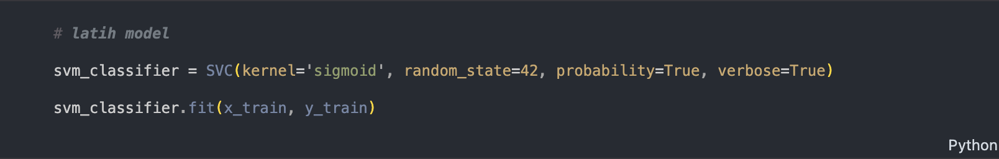 

- **Neural Network Classifier**, merupakan algoritma yang populer untuk masalah klasifikasi karena proses dari algoritma ini meniru cara kerja otak yang mempunyai neuron, pada kasus ini kita menggunakan multilayer perceptron agar platihan model semakin baik hasilnya. Adapun parameter yang digunakan yaitu:
  - hidden_layer_sizes=12 (jumlah hidden layer)
  - activation='relu' (aktivasi menggunakan relu)
  - n_iter_no_change=30 (proses pelatihan akan dihentikan jika bobot tidak berubah sebanyak 30 iterasi)
  - solver = 'adam' (optimizer menggunakan adam)  

  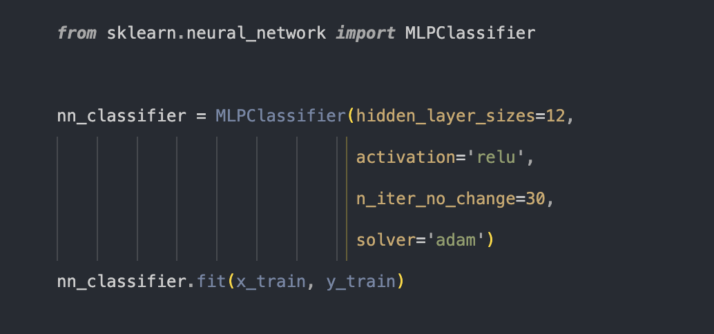 

## Evaluation

Berikut performa hasil prediksi setiap algoritma:.  
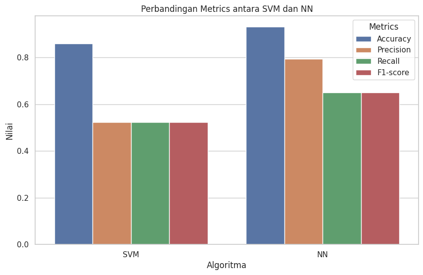 

- Classification Report SVM
 

- Classification Report SVM
 

## Kesimpulan
- Kesimpulan dari proyek ini dapat diketahui bahwa algoritma yang paling baik untuk mengatasi kasus ini adalah algoritma ***Neural Network*** karena memiliki akurasi **93%** yang lebih tinggi dibandingkan algoritma ***Support Vector Machine*** yaitu **86%**.

- Faktor yang paling mempengaruhi keputusan nasabah yaitu terdapat pada fitur ***Duration*** (durasi kontak terakhir, dalam hitungan detik) karena nilai korelasinya lebih tinggi ketimbang fitur-fitur lainnya.